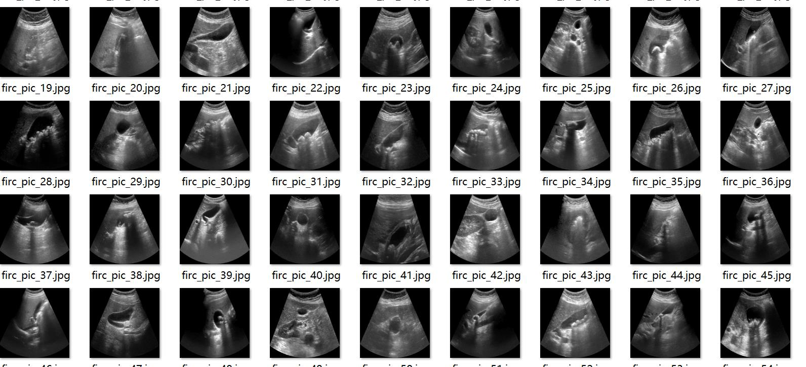
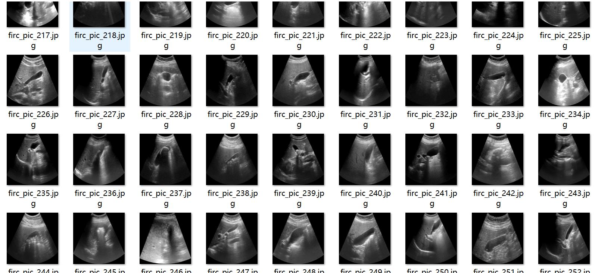
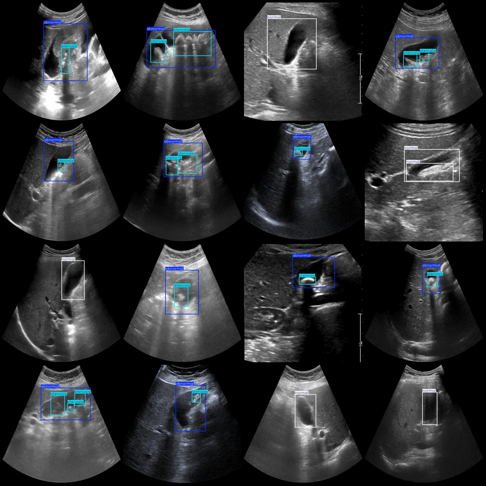
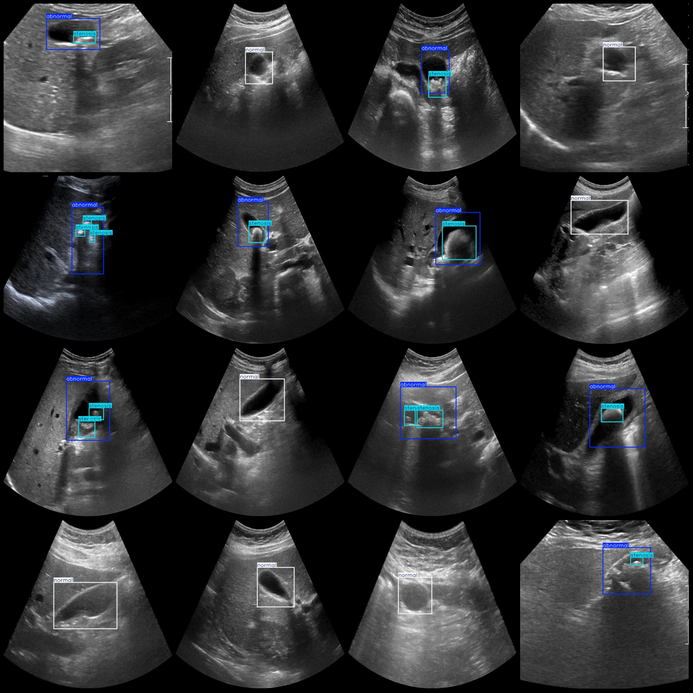

# Smart Medical: Gallbladder Pathology Detection Dataset - VOC+YOLO Format with 1210 Images, 3 Categories

Dataset format: Pascal VOC format + YOLO format (txt file without split path, only containing jpg images, corresponding VOC format xml files, and yolo format txt files)
Image count: 1210
Annotation count: 1210
Annotation count: 1210
Number of categories: 3
Category names in the annotation files (note that the order in the yolo format is not consistent with this, but refer to the "labels" folder's "classes.txt"): ["abnormal", "normal", "stenosis"]
Box counts for each category:
- abnormal boxes = 612
- normal boxes = 601
- stenosis boxes = 681
Total box count: 1894
Number of images per category:
- abnormal images = 612
- normal images = 598
- stenosis images = 612
Image resolution: 640x640
Annotation tool used: labelImg
Annotation rules: Draw bounding boxes for each category
Important note: The dataset does not have been split into training, validation, or test sets; you must do so yourself.
Special declaration: This dataset does not guarantee the accuracy of models trained on it or the weights files.
Image preview:
Annotation example:
## Images

Here is a pay link on Stripe ( https://buy.stripe.com/3cs8yP7sY87d0vu9AB ). Please contact me lonlonago@foxmail.com after funding $89, and I will send you a complete data files , thank you!

